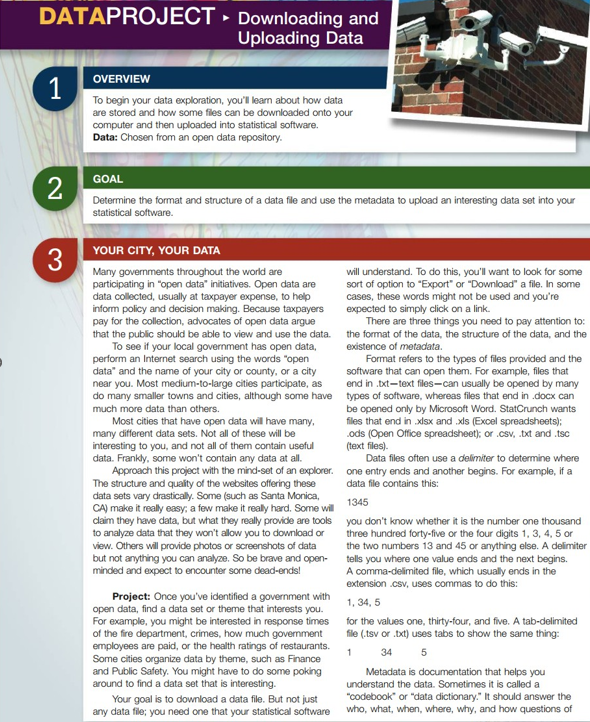

:::{#me}

## Projec-1: Big Data

the data. But most important, it should tell you what the variable names mean and what the values mean. With any luck, it will also tell you the data type (for example, is it a number or a character?).
Warning: you might have to look at a great many data files before you find one that is useful.
Assignment: Download a data set and write a report answering these questions:

1.	What is the URL of the page from which you downloaded your data?
2.	What file types are available for your data? What file type did you download?
3.	How many variables are there? How many observations?
 
4.	What does a row in the data set represent? In other words, what is the basic unit of observation?
5.	Why were these data collected? What is their purpose? How were they collected?
6.	In terms of megabytes (or gigabytes], how large is the file? (This information might not be available on the website; you might need to determine this using your computer's operating system.)
7.	Why were you interested in this data set? Give some examples of what you want to learn from these data.
8.	Try to upload the data to StatCrunch. Describe what happens. Did you get what you expected? Did you get an error? Describe the outcome.

## Project-2: Graphs and Charts

## Project-3: Estimations

## Prject-4: Hypothesis

:::

Thanks for checking out my website. Happy Learning!
